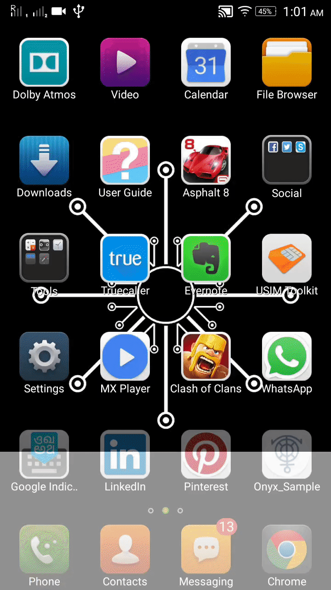

    

# onyx
----      
Onyx is a library for android that can be used by developers to understand what type of content they are enabling inside their apps.
An example can be to limit adult content in apps specifically made for children. Through Onyx you can get the characteristics of an image and then determine if you want to block it or allow it.
The possibilities are endless, there can be a zillion use case scenarios. Onyx is proud to be powered by world's best visual recognition technology - Clarifai.      
Note - The gathering of information about the images is done through the implementation of technologies like Artificial intelligence, machine learning, and deep learning.

------    
#Download    
###Using Gradle: under dependencies section:   
  
    compile 'com.hanuor.onyx:onyx:1.1.4'  

### or Using Maven:
    <dependency>
    <groupId>com.hanuor.onyx</groupId>
    <artifactId>onyx</artifactId>
    <version>1.1.4</version>
    <type>pom</type>
    </dependency>    

### or Using Ivy:         
     <dependency org='com.hanuor.onyx' name='onyx' rev='1.1.4'>
     <artifact name='$AID' ext='pom'></artifact>
     </dependency>	    
	 

------
#Documentation

###Getting tags for an Image
Pretty simple -  
Use **.getTagsfromApi() method.** Example is given below      

     Onyx.with(Context context).fromURL(String url).getTagsfromApi(new OnTaskCompletion() {
                    @Override
                    public void onComplete(ArrayList<String> response) {
                        //get an arraylist of tags here
                        //do whatever you want here
                            
                      }
                });
            }
        });

		
###Getting tags as well as their probability of occurring
Use the **.getTagsandProbability() method.** Example is given below       

      Onyx.with(Context context).fromURL(String url).getTagsandProbability(new OnTaskCompletion() {
                    @Override
                    public void onComplete(ArrayList<String> response) {
                       //results will be in the form of array-list
					   //for eg. - [Mammal-0.9972132, Wolf-0.9962321, Snow-0.993212]
					   //Do whatever you want to do here
                    }
                });
				
				
###Getting tags from a video (Whaaaaa......a!)
**Convert video into a stream of byte[].** and see the example below.    

     
	 Onyx.with(Context context).fromVideoArray(byte[] videoArray).getTagsfromApi(new OnTaskCompletion() {
					@Override
                    public void onComplete(ArrayList<String> response) {
                       //results will be in the form of array-list
					   //Do whatever you want to do here
                    }
                });       
				
###Getting tags and their probability of occurring from a video     
**Convert video into a stream of byte[].** and see the example below.    
     
	 Onyx.with(Context context).fromVideoArray(byte[] videoArray).getTagsandProbability(new OnTaskCompletion() {
					@Override
                    public void onComplete(ArrayList<String> response) {
                       //results will be in the form of array-list
					   //for eg. - [Mammal-0.9972132, Wolf-0.9962321, Snow-0.993212]
					  
					   //Do whatever you want to do here
                    }
                });  
				
				         
------
###Compatibility

**Minimum Android SDK**: Onyx requires a minimum API level of **7**.    

---------
###Special thanks to:       

Clarifai         
----------      
 
 **Please do notify us if you're using our library in your app. We'd be more than happy to list your app here!**    
-----------     
###How it looks like?     
      

[Onyx demo app](https://play.google.com/store/apps/details?id=com.hanuor.onyx_sample)

    

---------

###License
Copyright 2016 Hanuor, Inc.

   Licensed under the Apache License, Version 2.0 (the "License");
   you may not use this file except in compliance with the License.
   You may obtain a copy of the License at

       http://www.apache.org/licenses/LICENSE-2.0

   Unless required by applicable law or agreed to in writing, software
   distributed under the License is distributed on an "AS IS" BASIS,
   WITHOUT WARRANTIES OR CONDITIONS OF ANY KIND, either express or implied.
   See the License for the specific language governing permissions and
   limitations under the License.
